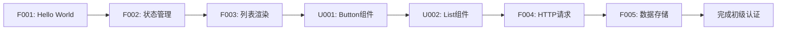

# HarmonyOS_In_Action

<div align="center">


**鸿蒙开发实战案例库 - 全面覆盖 OpenHarmony 和 HMS API**

[](https://developer.huawei.com/consumer/cn/harmonyos/)
[](https://developer.huawei.com/consumer/cn/doc/)
[](LICENSE)
[](examples/)

[📚 快速开始](#-快速开始) • [📖 案例索引](#-案例索引) • [🗺️ 学习路径](#️-学习路径) • [🤝 参与贡献](#-参与贡献)

</div>

---

## 📝 项目简介

**HarmonyOS_In_Action** 是一个全面、系统、实战的鸿蒙开发案例库，旨在通过 **150-200 个真实场景案例**，帮助开发者深度掌握鸿蒙应用开发。

### 🎯 项目特色

- **🎓 系统学习** - 从基础入门到高级特性，循序渐进的学习路径
- **💼 实战导向** - 每个案例都是真实业务场景，可直接用于项目
- **📊 全面覆盖** - 通过 **182个案例** 目标覆盖 **80%+ SDK 能力**（388个 OpenHarmony API + 163个 HMS API + 120个 UI组件）
- **🧪 测试驱动** - 每个案例都有完整测试，覆盖率 ≥90%
- **📐 规范编码** - 严格遵循鸿蒙官方开发规范和最佳实践
- **🔄 持续更新** - 紧跟鸿蒙版本更新，持续迭代
- **📦 轻量仓库** - 仅包含源码，`.gitignore` 过滤构建产物，182案例预计 <100MB

### 📊 当前进度

| 分类 | 计划案例数 | 已完成 | 覆盖率 |
|------|-----------|--------|--------|
| 01-基础入门 | 15 | 5 | 33.3% |
| 02-UI组件 | 25 | 0 | 0% |
| 03-布局导航 | 12 | 0 | 0% |
| 04-数据持久化 | 10 | 0 | 0% |
| 05-网络云服务 | 15 | 0 | 0% |
| 06-多媒体 | 18 | 0 | 0% |
| 07-AI能力 | 20 | 0 | 0% |
| 08-设备硬件 | 15 | 0 | 0% |
| 09-分布式 | 12 | 0 | 0% |
| 10-安全认证 | 12 | 0 | 0% |
| 11-性能优化 | 10 | 0 | 0% |
| 12-企业功能 | 8 | 0 | 0% |
| 13-综合项目 | 10 | 0 | 0% |
| **总计** | **182** | **5** | **2.7%** |

**API 覆盖率**: OpenHarmony 28/388 (7.2%) | HMS 5/163 (3.1%) | UI组件 18/120 (15%)

**已完成案例**:
- ✅ F001: Hello World - UIAbility, Text, Button
- ✅ F002: 状态管理进阶 - @State, @Prop, @Link, @Provide, @Consume
- ✅ F003: 列表渲染与优化 - List, ForEach, LazyForEach, IDataSource
- ✅ F004: 自定义组件与复用 - @Component, @Builder, @BuilderParam, Image, Row, Column, Scroll
- ✅ F005: 事件处理与手势 - onClick, onTouch, onHover, TapGesture, LongPressGesture, PanGesture, SwipeGesture, PinchGesture, RotationGesture, GestureGroup

---

## 🚀 快速开始

### 前置要求

- **DevEco Studio** ≥ 5.0.0
- **HarmonyOS SDK** ≥ 6.0.0 (API 20)
- **Node.js** ≥ 18.x
- **OHPM** ≥ 5.x

### 环境配置

1. **安装 DevEco Studio**

   访问 [DevEco Studio 官网](https://developer.huawei.com/consumer/cn/deveco-studio/) 下载并安装

2. **配置环境变量**（推荐，极大提升开发效率）

   将以下内容添加到 `~/.zshrc` 或 `~/.bashrc`：

   ```bash
   # DevEco Studio 和鸿蒙 SDK
   export DEVECO_HOME="/Applications/DevEco-Studio.app/Contents"
   export HARMONY_SDK="$DEVECO_HOME/sdk/default"

   # 工具链
   export PATH="$HARMONY_SDK/openharmony/toolchains:$PATH"
   export PATH="$DEVECO_HOME/tools/ohpm/bin:$PATH"
   export PATH="$DEVECO_HOME/tools/hvigor/bin:$PATH"

   # 快捷别名
   alias cde='cd $HARMONY_SDK/openharmony/ets/build-tools/ets-loader'
   alias cdets='cd $HARMONY_SDK/openharmony/ets'
   alias cdhms='cd $HARMONY_SDK/hms/ets'
   ```

   配置后执行：`source ~/.zshrc`

3. **克隆项目**

   ```bash
   # 方式1: 通过 Git 克隆（推荐）
   git clone git@github.com:mqxu/HarmonyOS_In_Action.git
   cd HarmonyOS_In_Action
   
   # 方式2: HTTPS 克隆
   git clone https://github.com/mqxu/HarmonyOS_In_Action.git
   
   # 方式3: 下载 ZIP 压缩包
   # 访问 https://github.com/mqxu/HarmonyOS_In_Action 下载
   ```

### 运行第一个案例

```bash
# 进入案例目录
cd examples/01_foundation/F001_hello_world

# 安装依赖
ohpm install

# 运行测试
npm run test

# 使用 DevEco Studio 打开项目并运行
# 或使用命令行
hvigorw assembleHap
hdc install entry-default-signed.hap
```

---

## 📖 案例索引

### 01 - 基础入门 (Foundation)

入门必备的基础知识，掌握 ArkTS 语法和核心概念。

| 编号 | 案例名称 | 难度 | 核心API | 状态 |
|------|---------|------|---------|------|
| F001 | [Hello HarmonyOS](examples/01_foundation/F001_hello_world) | 🟢 基础 | UIAbility, Text, Button | ✅ 已完成 |
| F002 | [状态管理进阶](examples/01_foundation/F002_state_management) | 🟡 中级 | @State, @Prop, @Link, @Provide, @Consume | ✅ 已完成 |
| F003 | [列表渲染与优化](examples/01_foundation/F003_list_rendering) | 🟡 中级 | List, ForEach, LazyForEach, IDataSource | ✅ 已完成 |
| F004 | [自定义组件与复用](examples/01_foundation/F004_custom_components) | 🟡 中级 | @Component, @Builder, @BuilderParam | ✅ 已完成 |
| F005 | [事件处理与手势](examples/01_foundation/F005_event_handling) | 🟡 中级 | onClick, Gesture, PanGesture | ✅ 已完成 |
| F006 | [动画基础](examples/01_foundation/F006_animations) | 🟡 中级 | animateTo, Animation | ⏳ 规划中 |
| F007 | [路由与导航](examples/01_foundation/F007_router_navigation) | 🟡 中级 | Router, Navigation | ⏳ 规划中 |
| F008 | [生命周期管理](examples/01_foundation/F008_lifecycle) | 🟡 中级 | UIAbility, Page Lifecycle | ⏳ 规划中 |
| F009 | [资源管理](examples/01_foundation/F009_resource_management) | 🟢 基础 | $r(), ResourceManager | ⏳ 规划中 |
| F010 | [国际化与本地化](examples/01_foundation/F010_i18n) | 🟡 中级 | @ohos.i18n, Locale | ⏳ 规划中 |
| F011 | [样式与主题](examples/01_foundation/F011_styles_themes) | 🟢 基础 | Styles, @Styles, @Extend | ⏳ 规划中 |
| F012 | [响应式布局基础](examples/01_foundation/F012_responsive_layout) | 🟡 中级 | GridRow, GridCol, MediaQuery | ⏳ 规划中 |
| F013 | [表单与输入验证](examples/01_foundation/F013_form_validation) | 🟡 中级 | TextInput, Checkbox, Form | ⏳ 规划中 |
| F014 | [弹窗与提示](examples/01_foundation/F014_dialogs_toast) | 🟢 基础 | AlertDialog, Toast, Prompt | ⏳ 规划中 |
| F015 | [基础综合案例](examples/01_foundation/F015_foundation_project) | 🟡 中级 | 综合前14个案例 | ⏳ 规划中 |

### 02 - UI 组件 (UI Components)

深度掌握鸿蒙 UI 组件库的使用和定制。

| 编号 | 案例名称 | 难度 | 核心API | 状态 |
|------|---------|------|---------|------|
| U001 | [Button 组件全解析](examples/02_ui_components/U001_button_showcase) | 🟢 基础 | Button, ButtonType | ⏳ 规划中 |
| U002 | [Text 文本显示](examples/02_ui_components/U002_text_showcase) | 🟢 基础 | Text, Span, TextStyle | ⏳ 规划中 |
| U003 | [Image 图片处理](examples/02_ui_components/U003_image_handling) | 🟡 中级 | Image, @ohos.multimedia.image | ⏳ 规划中 |
| U004 | [Swiper 轮播图](examples/02_ui_components/U004_swiper_carousel) | 🟡 中级 | Swiper, Indicator | ⏳ 规划中 |
| U005 | [Grid 网格布局](examples/02_ui_components/U005_grid_layout) | 🟡 中级 | Grid, GridItem | ⏳ 规划中 |
| U006 | [Tabs 标签页](examples/02_ui_components/U006_tabs) | 🟡 中级 | Tabs, TabContent | ⏳ 规划中 |
| U007 | [Scroll 滚动容器](examples/02_ui_components/U007_scroll) | 🟡 中级 | Scroll, Scroller | ⏳ 规划中 |
| U008 | [Slider 滑块](examples/02_ui_components/U008_slider) | 🟢 基础 | Slider, SliderStyle | ⏳ 规划中 |
| U009 | [Progress 进度条](examples/02_ui_components/U009_progress) | 🟢 基础 | Progress, ProgressType | ⏳ 规划中 |
| U010 | [Rating 评分](examples/02_ui_components/U010_rating) | 🟢 基础 | Rating | ⏳ 规划中 |
| U011 | [Toggle 开关](examples/02_ui_components/U011_toggle) | 🟢 基础 | Toggle, Checkbox, Radio | ⏳ 规划中 |
| U012 | [TextInput 输入框](examples/02_ui_components/U012_text_input) | 🟡 中级 | TextInput, TextArea | ⏳ 规划中 |
| U013 | [Picker 选择器](examples/02_ui_components/U013_picker) | 🟡 中级 | TextPicker, DatePicker, TimePicker | ⏳ 规划中 |
| U014 | [Menu 菜单](examples/02_ui_components/U014_menu) | 🟡 中级 | Menu, MenuItem | ⏳ 规划中 |
| U015 | [Panel 面板](examples/02_ui_components/U015_panel) | 🟡 中级 | Panel, SideBar | ⏳ 规划中 |
| U016 | [Badge 徽标](examples/02_ui_components/U016_badge) | 🟢 基础 | Badge | ⏳ 规划中 |
| U017 | [Refresh 下拉刷新](examples/02_ui_components/U017_refresh) | 🟡 中级 | Refresh, PullToRefresh | ⏳ 规划中 |
| U018 | [Canvas 画布](examples/02_ui_components/U018_canvas) | 🔴 高级 | Canvas, CanvasRenderingContext2D | ⏳ 规划中 |
| U019 | [Video 视频播放器](examples/02_ui_components/U019_video) | 🟡 中级 | Video, VideoController | ⏳ 规划中 |
| U020 | [Web 网页视图](examples/02_ui_components/U020_web) | 🔴 高级 | Web, WebController | ⏳ 规划中 |
| U021 | [XComponent 原生组件](examples/02_ui_components/U021_xcomponent) | 🔴 高级 | XComponent | ⏳ 规划中 |
| U022 | [Marquee 跑马灯](examples/02_ui_components/U022_marquee) | 🟢 基础 | Marquee | ⏳ 规划中 |
| U023 | [QRCode 二维码](examples/02_ui_components/U023_qrcode) | 🟢 基础 | QRCode | ⏳ 规划中 |
| U024 | [Search 搜索框](examples/02_ui_components/U024_search) | 🟡 中级 | Search | ⏳ 规划中 |
| U025 | [组件综合案例](examples/02_ui_components/U025_components_project) | 🔴 高级 | 综合UI组件 | ⏳ 规划中 |

### 03 - 布局与导航 (Layout & Navigation)

掌握复杂布局和页面导航技巧。

| 编号 | 案例名称 | 难度 | 核心API | 状态 |
|------|---------|------|---------|------|
| L001 | [Flex 弹性布局](examples/03_layout_navigation/L001_flex_layout) | 🟡 中级 | Flex, FlexOptions | ⏳ 规划中 |
| L002 | [Stack 堆叠布局](examples/03_layout_navigation/L002_stack_layout) | 🟢 基础 | Stack, ZIndex | ⏳ 规划中 |
| L003 | [RelativeContainer 相对布局](examples/03_layout_navigation/L003_relative_container) | 🟡 中级 | RelativeContainer | ⏳ 规划中 |
| L004 | [GridRow/GridCol 栅格](examples/03_layout_navigation/L004_grid_system) | 🟡 中级 | GridRow, GridCol | ⏳ 规划中 |
| L005 | [自适应布局](examples/03_layout_navigation/L005_adaptive_layout) | 🔴 高级 | MediaQuery, BreakpointSystem | ⏳ 规划中 |
| L006 | [Navigation 导航容器](examples/03_layout_navigation/L006_navigation) | 🟡 中级 | Navigation, NavRouter | ⏳ 规划中 |
| L007 | [Router 路由管理](examples/03_layout_navigation/L007_router) | 🟡 中级 | Router, UIAbilityContext | ⏳ 规划中 |
| L008 | [页面转场动画](examples/03_layout_navigation/L008_page_transition) | 🔴 高级 | PageTransition, TransitionEffect | ⏳ 规划中 |
| L009 | [底部导航栏](examples/03_layout_navigation/L009_bottom_navigation) | 🟡 中级 | Tabs, BottomTabBar | ⏳ 规划中 |
| L010 | [侧滑菜单](examples/03_layout_navigation/L010_drawer_menu) | 🟡 中级 | SideBarContainer | ⏳ 规划中 |
| L011 | [吸顶效果](examples/03_layout_navigation/L011_sticky_header) | 🟡 中级 | List, Sticky | ⏳ 规划中 |
| L012 | [布局综合案例](examples/03_layout_navigation/L012_layout_project) | 🔴 高级 | 综合布局 | ⏳ 规划中 |

### 04 - 数据持久化 (Data Persistence)

掌握各种数据存储方式。

| 编号 | 案例名称 | 难度 | 核心API | 状态 |
|------|---------|------|---------|------|
| D001 | [Preferences 首选项](examples/04_data_persistence/D001_preferences) | 🟢 基础 | @ohos.data.preferences | ⏳ 规划中 |
| D002 | [关系型数据库](examples/04_data_persistence/D002_relational_db) | 🟡 中级 | @ohos.data.relationalStore | ⏳ 规划中 |
| D003 | [键值型数据库](examples/04_data_persistence/D003_kv_store) | 🟡 中级 | @ohos.data.distributedKVStore | ⏳ 规划中 |
| D004 | [文件管理](examples/04_data_persistence/D004_file_management) | 🟡 中级 | @ohos.file.fs, FileIO | ⏳ 规划中 |
| D005 | [DataShare 数据共享](examples/04_data_persistence/D005_data_share) | 🔴 高级 | @ohos.data.dataShare | ⏳ 规划中 |
| D006 | [沙箱与应用文件](examples/04_data_persistence/D006_sandbox) | 🟡 中级 | Context, FilePath | ⏳ 规划中 |
| D007 | [数据加密存储](examples/04_data_persistence/D007_encrypted_storage) | 🔴 高级 | @ohos.security.cryptoFramework | ⏳ 规划中 |
| D008 | [数据迁移与备份](examples/04_data_persistence/D008_data_migration) | 🔴 高级 | Backup, Restore | ⏳ 规划中 |
| D009 | [云端数据同步](examples/04_data_persistence/D009_cloud_sync) | 🔴 高级 | CloudSync, CloudDatabase | ⏳ 规划中 |
| D010 | [持久化综合案例](examples/04_data_persistence/D010_persistence_project) | 🔴 高级 | 综合存储 | ⏳ 规划中 |

### 05 - 网络与云服务 (Network & Cloud)

掌握网络通信和云服务集成。

| 编号 | 案例名称 | 难度 | 核心API | 状态 |
|------|---------|------|---------|------|
| N001 | [HTTP 网络请求](examples/05_network_cloud/N001_http_request) | 🟡 中级 | @ohos.net.http | ⏳ 规划中 |
| N002 | [WebSocket 实时通信](examples/05_network_cloud/N002_websocket) | 🟡 中级 | @ohos.net.webSocket | ⏳ 规划中 |
| N003 | [文件上传下载](examples/05_network_cloud/N003_upload_download) | 🟡 中级 | @ohos.request | ⏳ 规划中 |
| N004 | [网络状态监听](examples/05_network_cloud/N004_network_status) | 🟢 基础 | @ohos.net.connection | ⏳ 规划中 |
| N005 | [RESTful API 实战](examples/05_network_cloud/N005_restful_api) | 🟡 中级 | HTTP + JSON | ⏳ 规划中 |
| N006 | [GraphQL 集成](examples/05_network_cloud/N006_graphql) | 🔴 高级 | GraphQL Client | ⏳ 规划中 |
| N007 | [推送服务](examples/05_network_cloud/N007_push_service) | 🔴 高级 | @hms.core.push | ⏳ 规划中 |
| N008 | [云存储服务](examples/05_network_cloud/N008_cloud_storage) | 🔴 高级 | @hms.core.deviceCloudGateway | ⏳ 规划中 |
| N009 | [云函数调用](examples/05_network_cloud/N009_cloud_function) | 🔴 高级 | Cloud Functions | ⏳ 规划中 |
| N010 | [即时通讯](examples/05_network_cloud/N010_instant_messaging) | 🔴 高级 | WebSocket + Push | ⏳ 规划中 |
| N011 | [网络缓存策略](examples/05_network_cloud/N011_cache_strategy) | 🟡 中级 | Cache, LRU | ⏳ 规划中 |
| N012 | [网络安全 HTTPS](examples/05_network_cloud/N012_https_security) | 🔴 高级 | SSL/TLS, Certificate | ⏳ 规划中 |
| N013 | [API Mock 与测试](examples/05_network_cloud/N013_api_mock) | 🟡 中级 | Mock Server | ⏳ 规划中 |
| N014 | [OAuth 认证](examples/05_network_cloud/N014_oauth) | 🔴 高级 | OAuth 2.0 | ⏳ 规划中 |
| N015 | [网络综合案例](examples/05_network_cloud/N015_network_project) | 🔴 高级 | 综合网络 | ⏳ 规划中 |

### 06 - 多媒体 (Multimedia)

掌握音频、视频、图片处理能力。

| 编号 | 案例名称 | 难度 | 核心API | 状态 |
|------|---------|------|---------|------|
| M001 | [图片加载与缓存](examples/06_multimedia/M001_image_loading) | 🟡 中级 | @ohos.multimedia.image | ⏳ 规划中 |
| M002 | [图片编辑与滤镜](examples/06_multimedia/M002_image_editing) | 🔴 高级 | ImageFilter, Canvas | ⏳ 规划中 |
| M003 | [音频播放器](examples/06_multimedia/M003_audio_player) | 🟡 中级 | @ohos.multimedia.audio | ⏳ 规划中 |
| M004 | [音频录制](examples/06_multimedia/M004_audio_recorder) | 🟡 中级 | AudioRecorder | ⏳ 规划中 |
| M005 | [视频播放器](examples/06_multimedia/M005_video_player) | 🟡 中级 | @ohos.multimedia.media | ⏳ 规划中 |
| M006 | [视频录制](examples/06_multimedia/M006_video_recorder) | 🔴 高级 | VideoRecorder | ⏳ 规划中 |
| M007 | [相机拍照](examples/06_multimedia/M007_camera_photo) | 🟡 中级 | @ohos.multimedia.camera | ⏳ 规划中 |
| M008 | [相机录像](examples/06_multimedia/M008_camera_video) | 🔴 高级 | CameraSession | ⏳ 规划中 |
| M009 | [二维码扫描](examples/06_multimedia/M009_qr_scanner) | 🟡 中级 | @hms.core.scan | ⏳ 规划中 |
| M010 | [图片选择器](examples/06_multimedia/M010_photo_picker) | 🟢 基础 | PhotoPicker | ⏳ 规划中 |
| M011 | [GIF 动图处理](examples/06_multimedia/M011_gif_handling) | 🔴 高级 | AnimatedImage | ⏳ 规划中 |
| M012 | [音频可视化](examples/06_multimedia/M012_audio_visualization) | 🔴 高级 | AudioAnalyzer, Canvas | ⏳ 规划中 |
| M013 | [视频编辑](examples/06_multimedia/M013_video_editing) | 🔴 高级 | AVEditor | ⏳ 规划中 |
| M014 | [水印添加](examples/06_multimedia/M014_watermark) | 🟡 中级 | Canvas, Image | ⏳ 规划中 |
| M015 | [屏幕录制](examples/06_multimedia/M015_screen_recording) | 🔴 高级 | ScreenCapture | ⏳ 规划中 |
| M016 | [AR 增强现实](examples/06_multimedia/M016_ar_scene) | 🔴 高级 | @hms.core.ar | ⏳ 规划中 |
| M017 | [3D 模型展示](examples/06_multimedia/M017_3d_model) | 🔴 高级 | Scene, Model3D | ⏳ 规划中 |
| M018 | [多媒体综合案例](examples/06_multimedia/M018_multimedia_project) | 🔴 高级 | 综合多媒体 | ⏳ 规划中 |

### 07 - AI 能力 (AI Capabilities)

探索 HMS AI 服务的强大能力。

| 编号 | 案例名称 | 难度 | 核心API | 状态 |
|------|---------|------|---------|------|
| A001 | [文字识别 OCR](examples/07_ai_capabilities/A001_ocr) | 🟡 中级 | @hms.ai.ocr | ⏳ 规划中 |
| A002 | [人脸检测](examples/07_ai_capabilities/A002_face_detection) | 🟡 中级 | @hms.ai.face | ⏳ 规划中 |
| A003 | [人脸比对](examples/07_ai_capabilities/A003_face_compare) | 🔴 高级 | @hms.ai.face.faceCompare | ⏳ 规划中 |
| A004 | [语音识别](examples/07_ai_capabilities/A004_speech_recognition) | 🟡 中级 | @hms.ai.speechRecognizer | ⏳ 规划中 |
| A005 | [语音合成 TTS](examples/07_ai_capabilities/A005_text_to_speech) | 🟡 中级 | @hms.ai.textToSpeech | ⏳ 规划中 |
| A006 | [文档扫描](examples/07_ai_capabilities/A006_document_scanner) | 🟡 中级 | @hms.ai.DocumentScanner | ⏳ 规划中 |
| A007 | [物体检测](examples/07_ai_capabilities/A007_object_detection) | 🔴 高级 | @hms.ai.vision | ⏳ 规划中 |
| A008 | [骨骼检测](examples/07_ai_capabilities/A008_skeleton_detection) | 🔴 高级 | @hms.ai.vision.skeletonDetector | ⏳ 规划中 |
| A009 | [主体分割](examples/07_ai_capabilities/A009_subject_segment) | 🔴 高级 | @hms.ai.vision.subjectSegmenter | ⏳ 规划中 |
| A010 | [图像超分辨率](examples/07_ai_capabilities/A010_image_super_resolution) | 🔴 高级 | ImageSR | ⏳ 规划中 |
| A011 | [智能翻译](examples/07_ai_capabilities/A011_translation) | 🟡 中级 | @hms.ai.mlTranslate | ⏳ 规划中 |
| A012 | [情感分析](examples/07_ai_capabilities/A012_sentiment_analysis) | 🔴 高级 | @hms.ai.nlp | ⏳ 规划中 |
| A013 | [智能推荐](examples/07_ai_capabilities/A013_recommendation) | 🔴 高级 | AI Recommendation | ⏳ 规划中 |
| A014 | [手势识别](examples/07_ai_capabilities/A014_gesture_recognition) | 🔴 高级 | GestureRecognition | ⏳ 规划中 |
| A015 | [智能体框架基础](examples/07_ai_capabilities/A015_agent_framework) | 🔴 高级 | @hms.ai.AgentFramework | ⏳ 规划中 |
| A016 | [本地大模型](examples/07_ai_capabilities/A016_local_chat_model) | 🔴 高级 | @hms.data.localChatModel | ⏳ 规划中 |
| A017 | [RAG 检索增强](examples/07_ai_capabilities/A017_rag) | 🔴 高级 | @hms.data.rag | ⏳ 规划中 |
| A018 | [知识图谱处理](examples/07_ai_capabilities/A018_knowledge_graph) | 🔴 高级 | @hms.data.knowledgeProcessor | ⏳ 规划中 |
| A019 | [AI 绘画](examples/07_ai_capabilities/A019_ai_painting) | 🔴 高级 | AI Generation | ⏳ 规划中 |
| A020 | [AI 综合案例](examples/07_ai_capabilities/A020_ai_project) | 🔴 高级 | 综合AI | ⏳ 规划中 |

### 08 - 设备与硬件 (Device & Hardware)

掌握设备能力和硬件访问。

| 编号 | 案例名称 | 难度 | 核心API | 状态 |
|------|---------|------|---------|------|
| H001 | [设备信息获取](examples/08_device_hardware/H001_device_info) | 🟢 基础 | @ohos.deviceInfo | ⏳ 规划中 |
| H002 | [传感器应用](examples/08_device_hardware/H002_sensors) | 🟡 中级 | @ohos.sensor | ⏳ 规划中 |
| H003 | [位置服务](examples/08_device_hardware/H003_location) | 🟡 中级 | @ohos.geoLocationManager | ⏳ 规划中 |
| H004 | [蓝牙通信](examples/08_device_hardware/H004_bluetooth) | 🔴 高级 | @ohos.bluetooth | ⏳ 规划中 |
| H005 | [Wi-Fi 管理](examples/08_device_hardware/H005_wifi) | 🟡 中级 | @ohos.wifiManager | ⏳ 规划中 |
| H006 | [NFC 功能](examples/08_device_hardware/H006_nfc) | 🔴 高级 | @ohos.nfc | ⏳ 规划中 |
| H007 | [振动反馈](examples/08_device_hardware/H007_vibrator) | 🟢 基础 | @ohos.vibrator | ⏳ 规划中 |
| H008 | [亮度调节](examples/08_device_hardware/H008_brightness) | 🟢 基础 | @ohos.brightness | ⏳ 规划中 |
| H009 | [电池状态](examples/08_device_hardware/H009_battery) | 🟢 基础 | @ohos.batteryInfo | ⏳ 规划中 |
| H010 | [剪贴板操作](examples/08_device_hardware/H010_pasteboard) | 🟢 基础 | @ohos.pasteboard | ⏳ 规划中 |
| H011 | [通知管理](examples/08_device_hardware/H011_notification) | 🟡 中级 | @ohos.notificationManager | ⏳ 规划中 |
| H012 | [通讯录访问](examples/08_device_hardware/H012_contacts) | 🟡 中级 | @ohos.contact | ⏳ 规划中 |
| H013 | [日历事件](examples/08_device_hardware/H013_calendar) | 🟡 中级 | Calendar API | ⏳ 规划中 |
| H014 | [NearLink 通信](examples/08_device_hardware/H014_nearlink) | 🔴 高级 | @hms.nearlink | ⏳ 规划中 |
| H015 | [硬件综合案例](examples/08_device_hardware/H015_hardware_project) | 🔴 高级 | 综合硬件 | ⏳ 规划中 |

### 09 - 分布式协同 (Distributed)

掌握鸿蒙核心分布式能力。

| 编号 | 案例名称 | 难度 | 核心API | 状态 |
|------|---------|------|---------|------|
| DS001 | [分布式数据库](examples/09_distributed/DS001_distributed_db) | 🔴 高级 | @ohos.data.distributedKVStore | ⏳ 规划中 |
| DS002 | [分布式文件](examples/09_distributed/DS002_distributed_file) | 🔴 高级 | @ohos.file.fs.distributedFile | ⏳ 规划中 |
| DS003 | [跨设备启动](examples/09_distributed/DS003_remote_start) | 🔴 高级 | UIAbilityContext.startAbility | ⏳ 规划中 |
| DS004 | [分布式任务调度](examples/09_distributed/DS004_distributed_task) | 🔴 高级 | DistributedSchedule | ⏳ 规划中 |
| DS005 | [设备发现与认证](examples/09_distributed/DS005_device_discovery) | 🔴 高级 | @ohos.distributedDeviceManager | ⏳ 规划中 |
| DS006 | [流转框架](examples/09_distributed/DS006_continuation) | 🔴 高级 | ContinuationManager | ⏳ 规划中 |
| DS007 | [跨端分享](examples/09_distributed/DS007_cross_device_share) | 🔴 高级 | @hms.collaboration.harmonyShare | ⏳ 规划中 |
| DS008 | [分布式剪贴板](examples/09_distributed/DS008_distributed_pasteboard) | 🔴 高级 | DistributedPasteboard | ⏳ 规划中 |
| DS009 | [RCP 协议通信](examples/09_distributed/DS009_rcp_protocol) | 🔴 高级 | @hms.collaboration.rcp | ⏳ 规划中 |
| DS010 | [分布式组件](examples/09_distributed/DS010_distributed_component) | 🔴 高级 | RemoteComponent | ⏳ 规划中 |
| DS011 | [多屏协同](examples/09_distributed/DS011_multi_screen) | 🔴 高级 | MultiScreen | ⏳ 规划中 |
| DS012 | [分布式综合案例](examples/09_distributed/DS012_distributed_project) | 🔴 高级 | 综合分布式 | ⏳ 规划中 |

### 10 - 安全与认证 (Security & Auth)

掌握应用安全和身份认证。

| 编号 | 案例名称 | 难度 | 核心API | 状态 |
|------|---------|------|---------|------|
| S001 | [华为账号登录](examples/10_security_auth/S001_huawei_account) | 🟡 中级 | @hms.core.account | ⏳ 规划中 |
| S002 | [生物识别认证](examples/10_security_auth/S002_biometric_auth) | 🟡 中级 | @ohos.userIAM.userAuth | ⏳ 规划中 |
| S003 | [FIDO 认证](examples/10_security_auth/S003_fido_auth) | 🔴 高级 | @hms.security.fido | ⏳ 规划中 |
| S004 | [数据加密解密](examples/10_security_auth/S004_encryption) | 🔴 高级 | @ohos.security.cryptoFramework | ⏳ 规划中 |
| S005 | [应用签名验证](examples/10_security_auth/S005_signature_verify) | 🔴 高级 | @ohos.security.cert | ⏳ 规划中 |
| S006 | [安全检测](examples/10_security_auth/S006_safety_detect) | 🔴 高级 | @hms.security.safetyDetect | ⏳ 规划中 |
| S007 | [权限管理](examples/10_security_auth/S007_permissions) | 🟡 中级 | @ohos.abilityAccessCtrl | ⏳ 规划中 |
| S008 | [隐私保护](examples/10_security_auth/S008_privacy) | 🔴 高级 | PrivacyManager | ⏳ 规划中 |
| S009 | [反欺诈防护](examples/10_security_auth/S009_antifraud) | 🔴 高级 | @hms.security.antifraudPicker | ⏳ 规划中 |
| S010 | [安全审计](examples/10_security_auth/S010_security_audit) | 🔴 高级 | @hms.security.securityAudit | ⏳ 规划中 |
| S011 | [可信认证](examples/10_security_auth/S011_trusted_auth) | 🔴 高级 | @hms.security.trustedAuthentication | ⏳ 规划中 |
| S012 | [安全综合案例](examples/10_security_auth/S012_security_project) | 🔴 高级 | 综合安全 | ⏳ 规划中 |

### 11 - 性能优化 (Performance)

掌握应用性能调优技巧。

| 编号 | 案例名称 | 难度 | 核心API | 状态 |
|------|---------|------|---------|------|
| P001 | [启动优化](examples/11_performance/P001_startup_optimization) | 🔴 高级 | LazyLoad, Preload | ⏳ 规划中 |
| P002 | [内存优化](examples/11_performance/P002_memory_optimization) | 🔴 高级 | MemoryProfiler | ⏳ 规划中 |
| P003 | [渲染优化](examples/11_performance/P003_render_optimization) | 🔴 高级 | RenderNode, @Reusable | ⏳ 规划中 |
| P004 | [列表性能优化](examples/11_performance/P004_list_performance) | 🔴 高级 | LazyForEach, CachedCount | ⏳ 规划中 |
| P005 | [图片加载优化](examples/11_performance/P005_image_optimization) | 🟡 中级 | ImageCache, Progressive | ⏳ 规划中 |
| P006 | [网络请求优化](examples/11_performance/P006_network_optimization) | 🟡 中级 | RequestQueue, Cache | ⏳ 规划中 |
| P007 | [数据库优化](examples/11_performance/P007_database_optimization) | 🔴 高级 | Index, Transaction | ⏳ 规划中 |
| P008 | [性能监控](examples/11_performance/P008_performance_monitor) | 🔴 高级 | @ohos.hiAppEvent, Trace | ⏳ 规划中 |
| P009 | [电量优化](examples/11_performance/P009_battery_optimization) | 🔴 高级 | PowerManager | ⏳ 规划中 |
| P010 | [性能综合案例](examples/11_performance/P010_performance_project) | 🔴 高级 | 综合优化 | ⏳ 规划中 |

### 12 - 企业功能 (Enterprise)

探索企业级应用场景。

| 编号 | 案例名称 | 难度 | 核心API | 状态 |
|------|---------|------|---------|------|
| E001 | [应用内支付](examples/12_enterprise/E001_iap) | 🔴 高级 | @hms.core.iap | ⏳ 规划中 |
| E002 | [电子发票](examples/12_enterprise/E002_invoice) | 🔴 高级 | @hms.core.account.invoiceAssistant | ⏳ 规划中 |
| E003 | [实名认证](examples/12_enterprise/E003_real_name) | 🔴 高级 | @hms.core.account.realNameVerification | ⏳ 规划中 |
| E004 | [数字钱包](examples/12_enterprise/E004_digital_wallet) | 🔴 高级 | @hms.core.payment.dcep | ⏳ 规划中 |
| E005 | [PDF 处理](examples/12_enterprise/E005_pdf_processing) | 🔴 高级 | @hms.officeservice.pdf | ⏳ 规划中 |
| E006 | [地图导航](examples/12_enterprise/E006_map_navigation) | 🔴 高级 | @hms.core.map | ⏳ 规划中 |
| E007 | [天气服务](examples/12_enterprise/E007_weather_service) | 🟡 中级 | @hms.core.weather | ⏳ 规划中 |
| E008 | [企业综合案例](examples/12_enterprise/E008_enterprise_project) | 🔴 高级 | 综合企业功能 | ⏳ 规划中 |

### 13 - 综合小项目 (Mini Projects)

实战综合应用项目。

| 编号 | 案例名称 | 难度 | 核心技术 | 状态 |
|------|---------|------|---------|------|
| MP001 | [待办事项应用](examples/13_mini_projects/MP001_todo_app) | 🟡 中级 | List + Preferences + 动画 | ⏳ 规划中 |
| MP002 | [记账本应用](examples/13_mini_projects/MP002_expense_tracker) | 🟡 中级 | RDB + Chart + 统计 | ⏳ 规划中 |
| MP003 | [天气预报](examples/13_mini_projects/MP003_weather_app) | 🟡 中级 | HTTP + HMS Weather + 位置 | ⏳ 规划中 |
| MP004 | [新闻资讯](examples/13_mini_projects/MP004_news_app) | 🟡 中级 | HTTP + WebView + 缓存 | ⏳ 规划中 |
| MP005 | [图片浏览器](examples/13_mini_projects/MP005_photo_gallery) | 🟡 中级 | Grid + Image + 手势 | ⏳ 规划中 |
| MP006 | [音乐播放器](examples/13_mini_projects/MP006_music_player) | 🔴 高级 | Audio + Service + 通知 | ⏳ 规划中 |
| MP007 | [视频播放器](examples/13_mini_projects/MP007_video_player) | 🔴 高级 | Video + 手势 + 全屏 | ⏳ 规划中 |
| MP008 | [即时通讯](examples/13_mini_projects/MP008_chat_app) | 🔴 高级 | WebSocket + Push + RDB | ⏳ 规划中 |
| MP009 | [电商应用](examples/13_mini_projects/MP009_shopping_app) | 🔴 高级 | 综合电商功能 | ⏳ 规划中 |
| MP010 | [健康计步](examples/13_mini_projects/MP010_fitness_tracker) | 🔴 高级 | Sensor + HMS Health + Chart | ⏳ 规划中 |

---

## 🗺️ 学习路径

### 🌱 初级开发者（0-3个月）

**目标**: 掌握基础知识，能开发简单应用



**推荐路径**: Foundation (F001-F010) → UI Components (U001-U010) → Layout (L001-L005)

**里程碑**:
- ✅ 完成 20 个基础案例
- ✅ 掌握 ArkTS 语法和状态管理
- ✅ 能独立开发单页面应用

### 🌿 中级开发者（3-6个月）

**目标**: 掌握进阶技能，能开发完整应用

**推荐路径**: Data Persistence → Network → Multimedia → Device

**里程碑**:
- ✅ 完成 50 个进阶案例
- ✅ 掌握网络请求和数据存储
- ✅ 能开发多页面应用

### 🌳 高级开发者（6-12个月）

**目标**: 掌握高级特性，能开发商业应用

**推荐路径**: AI → Distributed → Security → Performance → Mini Projects

**里程碑**:
- ✅ 完成 100+ 案例
- ✅ 掌握 HMS 高级能力
- ✅ 能开发商业级应用

---

## 🏗️ 项目结构

```
HarmonyOS_In_Action/
├── README.md                    # 项目说明
├── CONTRIBUTING.md              # 贡献指南
├── CODE_STYLE.md                # 代码规范
├── CHANGELOG.md                 # 更新日志
├── LICENSE                      # 开源协议
├── docs/                        # 文档中心
│   ├── learning_path/           # 学习路径指南
│   ├── api_coverage/            # API覆盖率报告
│   ├── best_practices/          # 最佳实践
│   └── troubleshooting.md       # 常见问题
├── common/                      # 公共基础库
│   ├── utils/                   # 工具类
│   ├── components/              # 通用组件
│   ├── constants/               # 常量定义
│   └── models/                  # 数据模型
├── examples/                    # 案例主目录
│   ├── 01_foundation/           # 基础入门
│   ├── 02_ui_components/        # UI组件
│   └── ...                      # 其他分类
├── templates/                   # 项目模板
│   ├── basic_example/           # 基础案例模板
│   └── README_template.md       # README模板
├── scripts/                     # 自动化脚本
│   ├── create_example.sh        # 创建新案例
│   ├── test_all.sh              # 批量测试
│   └── generate_docs.sh         # 生成文档
└── tools/                       # 开发工具
```

---

## 🤝 参与贡献

我们非常欢迎你的贡献！请查看 [贡献指南](CONTRIBUTING.md) 了解详情。

### 如何贡献

1. **Fork** 本仓库
2. 创建功能分支 (`git checkout -b feature/F020_new_example`)
3. 提交更改 (`git commit -m 'feat(foundation): 新增 F020 计时器案例'`)
4. 推送到分支 (`git push origin feature/F020_new_example`)
5. 创建 **Pull Request**

### 贡献者

感谢所有贡献者的付出！

<!-- ALL-CONTRIBUTORS-LIST:START -->
<!-- 贡献者列表自动生成 -->
<!-- ALL-CONTRIBUTORS-LIST:END -->

---

## 📄 开源协议

本项目采用 [MIT License](LICENSE) 开源协议。

---

## 🔗 相关资源

### 官方文档
- [HarmonyOS 开发者官网](https://developer.huawei.com/consumer/cn/harmonyos/)
- [华为开发者文档中心](https://developer.huawei.com/consumer/cn/doc/)（在文档中心搜索 "ArkTS"、"API 参考" 等关键词）
- [OpenHarmony 文档中心](https://docs.openharmony.cn/)
- [HMS Core 服务](https://developer.huawei.com/consumer/cn/hms/)

### 开发工具
- [DevEco Studio 下载](https://developer.huawei.com/consumer/cn/deveco-studio/)
- [OHPM 包管理中心](https://ohpm.openharmony.cn/)

### 社区
- [HarmonyOS 开发者论坛](https://developer.huawei.com/consumer/cn/forum/)

---

## ⭐ Star History

[](https://star-history.com/#mqxu/HarmonyOS_In_Action&Date)

---

<div align="center">

**如果这个项目对你有帮助，请给一个 ⭐ Star 支持我！**

Made with ❤️ by mqxu

</div>
