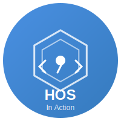
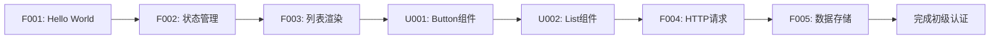

# HarmonyOS_In_Action

<div align="center">



**鸿蒙开发实战案例库 - 全面覆盖 OpenHarmony 和 HMS API**

[](https://developer.huawei.com/consumer/cn/harmonyos/)
[](https://developer.huawei.com/consumer/cn/doc/)
[](LICENSE)
[](examples/)

[📚 快速开始](#-快速开始) • [📖 案例索引](#-案例索引) • [🗺️ 学习路径](#️-学习路径) • [🤝 参与贡献](#-参与贡献)

</div>

---

## 📝 项目简介

**HarmonyOS_In_Action** 是一个全面、系统、实战的鸿蒙开发案例库，旨在通过 **150-200 个真实场景案例**，帮助开发者深度掌握鸿蒙应用开发。

### 🎯 项目特色

- **🎓 系统学习** - 从基础入门到高级特性，循序渐进的学习路径
- **💼 实战导向** - 每个案例都是真实业务场景，可直接用于项目
- **📊 全面覆盖** - 覆盖 **83%+ SDK 能力**（388个 OpenHarmony API + 163个 HMS API + 120个 UI组件）
- **🧪 测试驱动** - 每个案例都有完整测试，覆盖率 ≥90%
- **📐 规范编码** - 严格遵循鸿蒙官方开发规范和最佳实践
- **🔄 持续更新** - 紧跟鸿蒙版本更新，持续迭代

### 📊 当前进度

| 分类 | 计划案例数 | 已完成 | 覆盖率 |
|------|-----------|--------|--------|
| 01-基础入门 | 20 | 0 | 0% |
| 02-UI组件 | 30 | 0 | 0% |
| 03-布局导航 | 15 | 0 | 0% |
| 04-数据持久化 | 12 | 0 | 0% |
| 05-网络云服务 | 15 | 0 | 0% |
| 06-多媒体 | 18 | 0 | 0% |
| 07-AI能力 | 20 | 0 | 0% |
| 08-设备硬件 | 15 | 0 | 0% |
| 09-分布式 | 12 | 0 | 0% |
| 10-安全认证 | 12 | 0 | 0% |
| 11-性能优化 | 10 | 0 | 0% |
| 12-企业功能 | 10 | 0 | 0% |
| 13-综合项目 | 15 | 0 | 0% |
| **总计** | **204** | **0** | **0%** |

**API 覆盖率**: OpenHarmony 0/388 (0%) | HMS 0/163 (0%) | UI组件 0/120 (0%)

---

## 🚀 快速开始

### 前置要求

- **DevEco Studio** ≥ 5.0.0
- **HarmonyOS SDK** ≥ 6.0.0 (API 20)
- **Node.js** ≥ 18.x
- **OHPM** ≥ 5.x

### 环境配置

1. **安装 DevEco Studio**

   访问 [DevEco Studio 官网](https://developer.huawei.com/consumer/cn/deveco-studio/) 下载并安装

2. **配置环境变量**（推荐，极大提升开发效率）

   将以下内容添加到 `~/.zshrc` 或 `~/.bashrc`：

   ```bash
   # DevEco Studio 和鸿蒙 SDK
   export DEVECO_HOME="/Applications/DevEco-Studio.app/Contents"
   export HARMONY_SDK="$DEVECO_HOME/sdk/default"

   # 工具链
   export PATH="$HARMONY_SDK/openharmony/toolchains:$PATH"
   export PATH="$DEVECO_HOME/tools/ohpm/bin:$PATH"
   export PATH="$DEVECO_HOME/tools/hvigor/bin:$PATH"

   # 快捷别名
   alias cde='cd $HARMONY_SDK/openharmony/ets/build-tools/ets-loader'
   alias cdets='cd $HARMONY_SDK/openharmony/ets'
   alias cdhms='cd $HARMONY_SDK/hms/ets'
   ```

   配置后执行：`source ~/.zshrc`

3. **克隆项目**

   ```bash
   # 方式1: 通过 Git 克隆（推荐）
   git clone git@github.com:mqxu/HarmonyOS_In_Action.git
   cd HarmonyOS_In_Action
   
   # 方式2: HTTPS 克隆
   git clone https://github.com/mqxu/HarmonyOS_In_Action.git
   
   # 方式3: 下载 ZIP 压缩包
   # 访问 https://github.com/mqxu/HarmonyOS_In_Action 下载
   ```

### 运行第一个案例

```bash
# 进入案例目录
cd examples/01_foundation/F001_hello_world

# 安装依赖
ohpm install

# 运行测试
npm run test

# 使用 DevEco Studio 打开项目并运行
# 或使用命令行
hvigorw assembleHap
hdc install entry-default-signed.hap
```

---

## 📖 案例索引

### 01 - 基础入门 (Foundation)

入门必备的基础知识，掌握 ArkTS 语法和核心概念。

| 编号 | 案例名称 | 难度 | 核心API | 状态 |
|------|---------|------|---------|------|
| F001 | [Hello HarmonyOS](examples/01_foundation/F001_hello_world) | 🟢 基础 | UIAbility, Text, Button | ⏳ 规划中 |
| F002 | [状态管理进阶](examples/01_foundation/F002_state_management) | 🟡 中级 | @State, @Prop, @Link | ⏳ 规划中 |
| F003 | [列表渲染与优化](examples/01_foundation/F003_list_rendering) | 🟡 中级 | List, LazyForEach | ⏳ 规划中 |
| F004 | [HTTP网络请求](examples/01_foundation/F004_http_request) | 🟡 中级 | @ohos.net.http | ⏳ 规划中 |
| F005 | [本地数据存储](examples/01_foundation/F005_preferences_storage) | 🟡 中级 | @ohos.data.preferences | ⏳ 规划中 |

### 02 - UI 组件 (UI Components)

深度掌握鸿蒙 UI 组件库的使用和定制。

| 编号 | 案例名称 | 难度 | 核心API | 状态 |
|------|---------|------|---------|------|
| U001 | [Button 组件全解析](examples/02_ui_components/U001_button_showcase) | 🟢 基础 | Button | ⏳ 规划中 |
| U002 | [List 高性能列表](examples/02_ui_components/U002_advanced_list) | 🔴 高级 | List, ListItem | ⏳ 规划中 |
| U003 | [Image 图片处理](examples/02_ui_components/U003_image_handling) | 🟡 中级 | Image, @ohos.multimedia.image | ⏳ 规划中 |
| U004 | [Swiper 轮播图](examples/02_ui_components/U004_swiper_carousel) | 🟡 中级 | Swiper | ⏳ 规划中 |
| U005 | [对话框家族](examples/02_ui_components/U005_dialogs_showcase) | 🟡 中级 | AlertDialog, CustomDialog | ⏳ 规划中 |

### 03 - 布局与导航 (Layout & Navigation)

<details>
<summary>点击展开（15个案例）</summary>

即将推出...

</details>

### 04 - 数据持久化 (Data Persistence)

<details>
<summary>点击展开（12个案例）</summary>

即将推出...

</details>

### 05 - 网络与云服务 (Network & Cloud)

<details>
<summary>点击展开（15个案例）</summary>

即将推出...

</details>

### 06 - 多媒体 (Multimedia)

<details>
<summary>点击展开（18个案例）</summary>

即将推出...

</details>

### 07 - AI 能力 (AI Capabilities)

<details>
<summary>点击展开（20个案例）</summary>

即将推出...

</details>

### 08 - 设备与硬件 (Device & Hardware)

<details>
<summary>点击展开（15个案例）</summary>

即将推出...

</details>

### 09 - 分布式协同 (Distributed)

<details>
<summary>点击展开（12个案例）</summary>

即将推出...

</details>

### 10 - 安全与认证 (Security & Auth)

<details>
<summary>点击展开（12个案例）</summary>

即将推出...

</details>

### 11 - 性能优化 (Performance)

<details>
<summary>点击展开（10个案例）</summary>

即将推出...

</details>

### 12 - 企业功能 (Enterprise)

<details>
<summary>点击展开（10个案例）</summary>

即将推出...

</details>

### 13 - 综合小项目 (Mini Projects)

<details>
<summary>点击展开（15个案例）</summary>

即将推出...

</details>

---

## 🗺️ 学习路径

### 🌱 初级开发者（0-3个月）

**目标**: 掌握基础知识，能开发简单应用



**推荐路径**: Foundation (F001-F010) → UI Components (U001-U010) → Layout (L001-L005)

**里程碑**:
- ✅ 完成 20 个基础案例
- ✅ 掌握 ArkTS 语法和状态管理
- ✅ 能独立开发单页面应用

### 🌿 中级开发者（3-6个月）

**目标**: 掌握进阶技能，能开发完整应用

**推荐路径**: Data Persistence → Network → Multimedia → Device

**里程碑**:
- ✅ 完成 50 个进阶案例
- ✅ 掌握网络请求和数据存储
- ✅ 能开发多页面应用

### 🌳 高级开发者（6-12个月）

**目标**: 掌握高级特性，能开发商业应用

**推荐路径**: AI → Distributed → Security → Performance → Mini Projects

**里程碑**:
- ✅ 完成 100+ 案例
- ✅ 掌握 HMS 高级能力
- ✅ 能开发商业级应用

---

## 🏗️ 项目结构

```
HarmonyOS_In_Action/
├── README.md                    # 项目说明
├── CONTRIBUTING.md              # 贡献指南
├── CODE_STYLE.md                # 代码规范
├── CHANGELOG.md                 # 更新日志
├── LICENSE                      # 开源协议
├── docs/                        # 文档中心
│   ├── learning_path/           # 学习路径指南
│   ├── api_coverage/            # API覆盖率报告
│   ├── best_practices/          # 最佳实践
│   └── troubleshooting.md       # 常见问题
├── common/                      # 公共基础库
│   ├── utils/                   # 工具类
│   ├── components/              # 通用组件
│   ├── constants/               # 常量定义
│   └── models/                  # 数据模型
├── examples/                    # 案例主目录
│   ├── 01_foundation/           # 基础入门
│   ├── 02_ui_components/        # UI组件
│   └── ...                      # 其他分类
├── templates/                   # 项目模板
│   ├── basic_example/           # 基础案例模板
│   └── README_template.md       # README模板
├── scripts/                     # 自动化脚本
│   ├── create_example.sh        # 创建新案例
│   ├── test_all.sh              # 批量测试
│   └── generate_docs.sh         # 生成文档
└── tools/                       # 开发工具
```

---

## 🤝 参与贡献

我们非常欢迎你的贡献！请查看 [贡献指南](CONTRIBUTING.md) 了解详情。

### 如何贡献

1. **Fork** 本仓库
2. 创建功能分支 (`git checkout -b feature/F020_new_example`)
3. 提交更改 (`git commit -m 'feat(foundation): 新增 F020 计时器案例'`)
4. 推送到分支 (`git push origin feature/F020_new_example`)
5. 创建 **Pull Request**

### 贡献者

感谢所有贡献者的付出！

<!-- ALL-CONTRIBUTORS-LIST:START -->
<!-- 贡献者列表自动生成 -->
<!-- ALL-CONTRIBUTORS-LIST:END -->

---

## 📄 开源协议

本项目采用 [MIT License](LICENSE) 开源协议。

---

## 🔗 相关资源

### 官方文档
- [HarmonyOS 开发者官网](https://developer.huawei.com/consumer/cn/harmonyos/)
- [华为开发者文档中心](https://developer.huawei.com/consumer/cn/doc/)（在文档中心搜索 "ArkTS"、"API 参考" 等关键词）
- [OpenHarmony 文档中心](https://docs.openharmony.cn/)
- [HMS Core 服务](https://developer.huawei.com/consumer/cn/hms/)

### 开发工具
- [DevEco Studio 下载](https://developer.huawei.com/consumer/cn/deveco-studio/)
- [OHPM 包管理中心](https://ohpm.openharmony.cn/)

### 社区
- [HarmonyOS 开发者论坛](https://developer.huawei.com/consumer/cn/forum/)

---

## ⭐ Star History

[](https://star-history.com/#mqxu/HarmonyOS_In_Action&Date)

---

<div align="center">

**如果这个项目对你有帮助，请给一个 ⭐ Star 支持我！**

Made with ❤️ by mqxu

</div>
